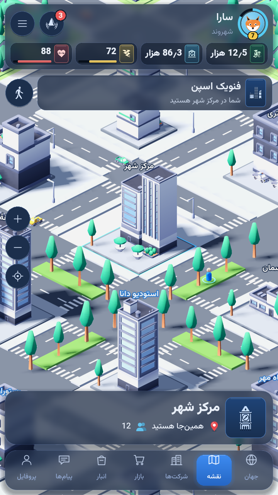
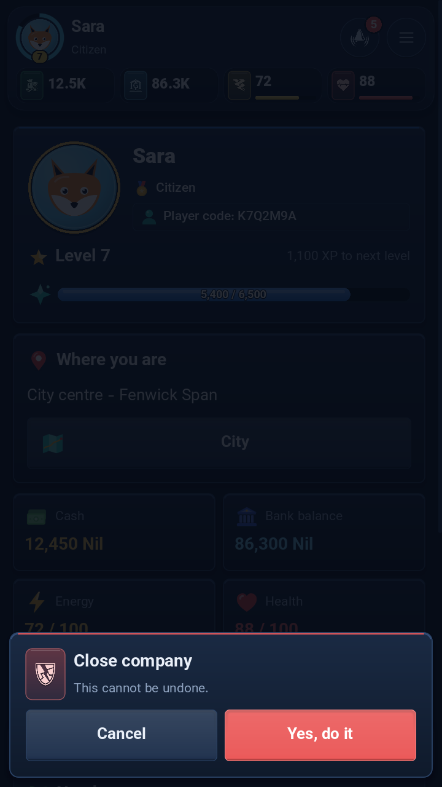
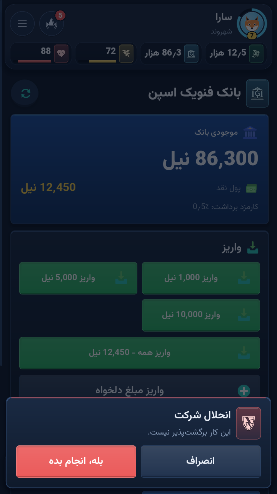

# Torncity — game client

A Godot 4 client for **Torncity**, a live, Persian-first city-life MMORPG. The
game server is separate (Go); until now players reached it through a Telegram
bot. This client talks to the same game through the server's client API: it
draws the key screens natively (the city map, profile, bank, backpack, work,
life, travel) and shows every other part of the game as a styled card of the
server's own text and buttons, so all features are playable from day one.

The primary target is the **web build running inside Telegram as a Mini App**
(it signs in with Telegram automatically). Android and desktop builds sign in
with a one-time code from the bot.

<p align="center">
  
  
  
</p>

## Run it

Requirements: Godot **4.7.2-stable** (standard build, not .NET). See
[docs/tooling.md](docs/tooling.md) for the pinned download and its checksum.

**Offline demo (mock server)** — the default. No server needed:

```sh
godot --path .            # or open project.godot in the editor and press Play
```

Any 8 letters or digits work as the link code. The mock answers the same API
routes and speaks the same realtime protocol as the real server, with
fixtures that mirror the game's content.

**Against a real server:**

```sh
godot --path . -- --live --api=https://game.example.com --ws=wss://rt.example.com/connection/websocket
```

or set `mock=false` and the URLs in `config/client.local.cfg` (copy of
`config/client.cfg`, git-ignored), or change them in the in-game Settings. In a
web build, `?api=…&ws=…&mock=0&lang=en` on the page URL does the same.

Signing in: send `/link` (or «اتصال») to the game bot and type the 8-character
code. Inside Telegram (web build opened as a Mini App) there is no code: the
client signs in with Telegram's signed `initData`.

**Tests** (headless, no window):

```sh
godot --headless --path . -s tests/run_tests.gd
```

**Screenshots** of the key screens in both languages: `dev/screenshots.sh`
(renders into `docs/screenshots/{fa,en}/`).

## Layout

| Path | What |
|---|---|
| `src/autoload/` | Config, I18n, AppTheme, Session, Api (HTTP + token refresh), Realtime (Centrifugo), TelegramApp (Mini App bridge), Game (the loop) |
| `src/net/` | Pure logic: Centrifugo protocol, token rules, sign-in decision, transports |
| `src/core/` | Number/money/duration formatting with Persian digits, view → screen routing, emoji → icon anchors |
| `src/scenes/` | Splash, link login, the shell (HUD, content, tab bar, toasts) |
| `src/screens/` | One scene per native screen, plus the generic card |
| `src/world/` | The isometric city map, its layout and the walking character |
| `src/ui/` | The UI kit: glow panels, bars, rings, avatar, HUD, tab bar, toasts, motion |
| `src/mock/` | The offline server and its fixtures |
| `assets/art/` | All art, addressed through `manifest.json` slots |
| `art_src/` | The art generators (vector SVG in Python, 3D renders in Blender) |
| `i18n/` | Client-shell strings (fa, en). Game text comes from the server |
| `tests/` | The test runner and tests |
| `docs/` | Architecture, art style, tooling, screenshots |

More: [docs/architecture.md](docs/architecture.md) ·
[docs/art-style.md](docs/art-style.md) · [docs/tooling.md](docs/tooling.md)

## Licences

- Code: no licence has been chosen yet (all rights reserved until one is added).
- Art in `assets/art/` is original work made for Torncity, generated by the
  scripts in `art_src/`.
- Font: [Vazirmatn](https://github.com/rastikerdar/vazirmatn) by Saber
  Rastikerdar, SIL Open Font License 1.1 — `assets/fonts/vazirmatn/OFL.txt`.

---

# تورن‌سیتی — برنامهٔ بازی

برنامهٔ Godot 4 برای **تورن‌سیتی**، بازی آنلاین و زندهٔ زندگی شهری با اولویت
زبان فارسی. سرور بازی جداست (Go) و تا امروز بازیکنان از راه ربات تلگرام بازی
می‌کردند. این برنامه با همان بازی از راه API سرور حرف می‌زند: صفحه‌های اصلی
(نقشهٔ شهر، پروفایل، بانک، کوله‌پشتی، کار، زندگی، سفر) را خودش می‌کشد و هر بخش
دیگر بازی را به‌صورت کارتی از متن و دکمه‌های خود سرور نشان می‌دهد؛ پس همهٔ
بخش‌های بازی از روز اول در دسترس است.

هدف اصلی **نسخهٔ وب درون تلگرام (Mini App)** است که خودکار با حساب تلگرام وارد
می‌شود. نسخهٔ اندروید و دسکتاپ با کد یک‌بارمصرف ربات وارد می‌شوند.

## اجرا

نیازمندی: Godot نسخهٔ **4.7.2-stable** (جزئیات در
[docs/tooling.md](docs/tooling.md)).

- **نسخهٔ آزمایشی آفلاین** (پیش‌فرض، بدون سرور): `godot --path .` — هر کد ۸
  حرفی پذیرفته می‌شود.
- **با سرور واقعی**:
  `godot --path . -- --live --api=https://… --ws=wss://…/connection/websocket`
  یا تنظیم نشانی‌ها در `config/client.local.cfg` یا صفحهٔ «تنظیمات» برنامه.
- **ورود**: در ربات بازی `/link` یا «اتصال» را بفرستید و کد ۸ حرفی را وارد کنید.
  درون تلگرام نیازی به کد نیست.
- **آزمون‌ها**: `godot --headless --path . -s tests/run_tests.gd`
- **تصویر صفحه‌ها**: `dev/screenshots.sh`

## مجوزها

تصویرهای `assets/art/` اثر اختصاصی تورن‌سیتی است و با اسکریپت‌های `art_src/`
ساخته می‌شود. قلم وزیرمتن اثر صابر راستی‌کردار با مجوز SIL OFL 1.1 است.
